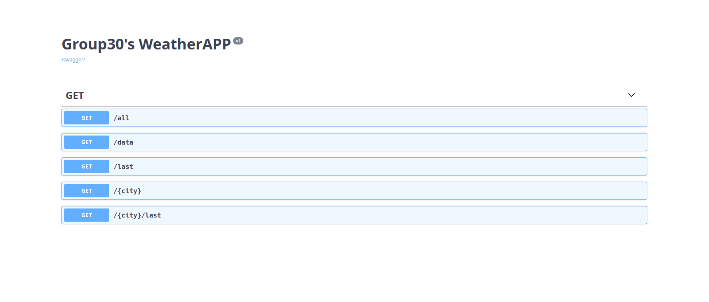

<h4 align="center">
  
</h4>

**Welcome to the WeatherSim!** \
This program will simulate a weather database and
server in which for you to retrieve data from. Our main goal is to
 demonstrate basic socket programming with **UDP** and **TCP**.

---
# Where to find the files for the assignment 

For the MVP: 
```
weather_station_data_sender.py  # Using UDP socket 
server.py                       # Using UDP socket 
client_server.py                # Using TCP socket
weather_app_client.py           # Using TCP socket
```

The extra features:
```
A beatiful website
Flask REST api
Docker
```
# Installation

## Configuration

With [Python 3.8+](https://Python.org/) 

To install requirements/dependencies:
```sh
$ pip install -r requirements.txt  # or
$ pip3 install -r requirements.txt
```
## Production
### Automatically with Docker
For a very quick and easy deploy of your app we recommend hosting the app as a Docker multi-container and running that.
It is fairly straight forward:
```sh
$ sudo docker-compose up -d && sudo docker attach user_client
```
Press **Return** after you have run the command above, and you should be greeted with the message:
```sh
### WeatherAPP 2.0 ###
WebApp running on http://0.0.0.0:5000/
Press 'help' for Commands | press Enter to exit 
```

If changes to the project are made you can redeploy with:
```sh
$ sudo docker-compose up -d --build --force-recreate && sudo docker attach user_client
```
This will force Docker to use the newly edited files for the images that is run in the containers

### Manually
For manually deploying you need to run these python scripts simultaneous in their specific folders:
```sh
$ python client_server.py                # /server
$ python server.pu                       # /server
$ python weather_station_data_sender.py  # /station
$ python app.py                          # /server/webapp
$ python weather_app_client.py           # /client

```
**NOTE:** We highly recommend you to use Docker instead of the manual approach.
# Usage
We have three ways of interacting with the app, a shell `WeatherAppClient`, [Website](http://group30.codes), and [REST api](http://group30.codes/swagger-ui/).  


## How to use the shell/CLI
The`WeatherAppClient` is a command line program. \
You can use it to view the weather data that has been generated

To see possible commands, type:
```zsh
$ WAclient> help
```

To receive all data since the simulation start, type:
```zsh
$ WAclient> get data all
```

You can also use the flask app we made to view the data in a browser

## About

Data will be periodically generated from `station.py`. `weather_station_data_sender.py` then transmits
the data by UDP to `server.py` which stores it to `data.json`. This data can then get read from `client_server.py` with TCP
by the command line program `weather_app_client.py`. The flask webapp will be able to read the data from the `data.json` and 
renders an index.html webpage with data from the last 24h in a graph and last readings in big bold letters. The webapp also has an REST API that allows for
specific get request over HTTP. 

## Illustrated model 
<h4 align="center">
  
</h4>

## REST API Documentation
We use REST API Documentation Tool | [Swagger UI](https://swagger.io/tools/swagger-ui/) for documenting of the REST API.
Swagger UI allows visualizing and interact with the API's resources. 
<h4 align="center">
  
</h4>

## Known bugs

`data.json` will eventually get very big, limiting *the whole god-damn operation.*

`docker_entrypoint.sh` may be changed by Git automatically to have a CLRF ending on Windows machine if this option is enabled in your local Git. When `docker_entrypoint.sh` has End of line sequence set as CLRF the `docker compose up` command will fail to launch the server, and you will get a error that may look like `standard_init_linux.go:219: exec user process caused: no such file or directory`. The fix is either no not use Windows EOL symbols or change just `docker_entrypoint.sh` EOL to have Unix-style EOL `LF`.

---   

## Participants: 

Students: \
[`Ståle Jacobsen`](https://github.com/StaleJ) the tech lead \
[`Erlend Haugen`](https://github.com/HaugPixel) the bug killer\
[`Kim Andre Grønstøl`](https://github.com/KimAndreG) the web maestro \
[`Martin Eide`](https://github.com/mrtineide) the composer \
[`Henrik Eide`](https://github.com/HenrikEide) the architect 

TI's: \
[`Lenanomous`](https://github.com/daq012) \
[`Sedrick Varnes`](https://github.com/sedrickvarnes)


### CopyRight
<a href='https://pngtree.com/so/cartoon'>cartoon png from pngtree.com</a>
